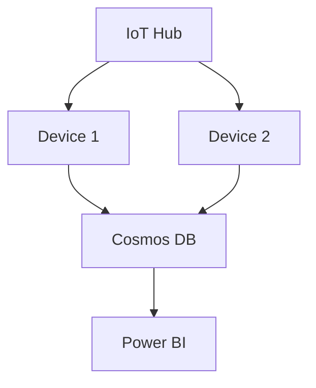

# Azure IoT Lab Documentation

## Introduction

The Azure IoT Lab is designed to help students and businesses practice working with real IoT data using Microsoft Azure services. This lab environment enables users to learn about IoT Hub, data collection, security, device simulation, and real-time data analysis.

## 1. Architecture Design

### Objectives:
- Define the overall architecture of the lab environment.
- Identify necessary components (sensors, devices, platforms).
- Create a topology diagram for the IoT Hub.

### Architecture:
The architecture consists of key components necessary for IoT communication:

- **Azure IoT Hub**: The central communication point between IoT devices and Azure services.
- **IoT Devices**: Physical sensors (temperature, humidity, pressure, motion) or IoT simulators for generating data.
- **Data Storage**: Use **Cosmos DB** or **SQL Database** to store sensor data.
- **Stream Analytics**: For real-time processing of data streams.
- **Power BI**: For visualizing collected data.

### Architecture Diagram (Mermaid):

```mermaid
graph LR
A[IoT Hub] --> B[IoT Device (Sensors)]
B --> C[Cosmos DB]
C --> D[Stream Analytics]
D --> E[Power BI]
```

## 2. Setting Up the IoT Hub

### Steps:
1. **Create the IoT Hub**:
   - Log in to your Azure portal.
   - Create an **IoT Hub** in your desired region.
   - Note down the **Hub name** and connection details for device configuration.

2. **Configure IoT Devices**:
   - Register each device in the IoT Hub using the portal or PowerShell scripts for automated device registration.
   - Associate access keys for secure communication with the IoT Hub.

3. **Test Connectivity**:
   - Use **Azure CLI** or Python scripts to test the connectivity of devices to the IoT Hub.

### Connectivity Test Script (Python):

```python
import iothub_client
from azure.iot.device import IoTHubDeviceClient, Message

def send_data(device_connection_string):
    client = IoTHubDeviceClient.create_from_connection_string(device_connection_string)
    message = Message("Hello from IoT device")
    client.send_message(message)

send_data('Your_Device_Connection_String')
```

## 3. Data Collection and Management

### Steps:
1. **Collect IoT Data**:
   - Configure devices to collect specific data (e.g., temperature, humidity, pressure).
   
2. **Store Data**:
   - Send collected data to **Cosmos DB** or **SQL Database** for long-term management and future analysis.

3. **Data Analysis**:
   - Use **Azure Stream Analytics** for real-time analysis of incoming data streams.

### Example Stream Analytics Query for Temperature Data:

```sql
SELECT DeviceId, AVG(Temperature) AS AvgTemperature
INTO output
FROM input
GROUP BY DeviceId, TumblingWindow(second, 60)
```

## 4. Setting Up Data Emulation

### Objectives:
- Create scripts to emulate real-world data using IoT simulators or Node.js scripts.

### Data Emulation Script (Node.js):

```javascript
const { Client } = require('azure-iot-device');
const { Mqtt } = require('azure-iot-device-mqtt');

const client = Client.fromConnectionString('Your_Connection_String', Mqtt);

function sendData() {
    const message = new Message(JSON.stringify({
        temperature: Math.random() * 100,
        humidity: Math.random() * 100
    }));
    client.sendEvent(message, (err) => {
        if (err) {
            console.log('Error sending message: ' + err.toString());
        } else {
            console.log('Message sent successfully');
        }
    });
}

setInterval(sendData, 5000);
```

### Test Emulation with IoT Hub:
Run the IoT device simulator to send data at regular intervals to the IoT Hub and visualize it in Power BI or on a Stream Analytics dashboard.

## 5. Security and Device Management

### Steps:
1. **Secure IoT Devices**:
   - Use certificates and keys to secure communications.
   - Implement **Role-Based Access Control (RBAC)** for managing user and device permissions.

2. **Remote Device Management**:
   - Set up scripts to perform remote updates to IoT devices.

3. **Security Best Practices**:
   - Enable certificate-based authentication to prevent spoofing attacks.
   - Restrict access to IoT services using user-specific roles.

## 6. Documentation and Usage Scenarios

### Writing Documentation:
The documentation should include:

- **Setup Procedures**: Detailed instructions for configuring the IoT Hub and devices.
- **Use Scenarios**: Practical scenarios for students and businesses.

### Sample Use Scenarios:
- **Scenario 1**: Monitor environmental conditions (temperature, humidity) and receive alerts when thresholds are exceeded.
- **Scenario 2**: Emulate an IoT device with variable data for testing real-time analytics.

### Create a Website for the Documentation:
The website will contain:

1. **Introduction**: Overview of the lab and objectives.
2. **Topology**: Detailed architecture diagrams (Mermaid).
3. **Practical Guides**: Step-by-step instructions for each component of the lab.
4. **Use Examples**: Demonstrations and practical use cases.

### Example Architecture Diagram (Mermaid):



## Conclusion

This Azure IoT platform provides an excellent opportunity for students and businesses to train and practice with real-world IoT data, helping them understand how to deploy, manage, and analyze data from IoT devices using Azure services.

---

### Made by Houssem-eddine Lahmar  
Élève ingénieur à l’École Nationale d'Ingénieurs de Tunis (ENIT)  
GitHub: [Houssem Lahmar](https://github.com/HoussemLahmar/)
